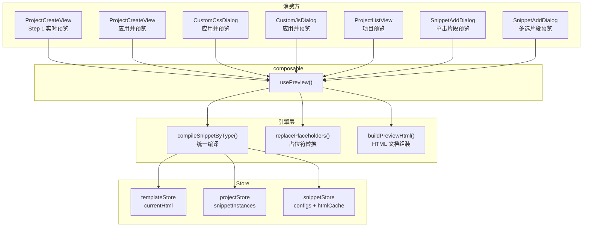

## 产品概述

重构模板生成器项目的预览渲染逻辑，实现统一、可靠、全场景覆盖的预览能力，并增强片段添加对话框的预览功能。

## 核心需求

### 需求1：统一预览渲染重构

1. **Step 1 模板实时预览增强**：切换选择模板时动态渲染预览，若项目已有新增片段，需将启用的所有片段注入模板综合展示（用户数据 > 示例数据 > 留空）
2. **统一预览渲染管道**：将 4 处重复的片段渲染逻辑（ProjectCreateView、CustomCssDialog、CustomJsDialog、ProjectListView）抽取为单一 composable，消除代码重复
3. **全场景预览一致性**：创建过程、定制 CSS/JS、列表页等所有预览入口均正确渲染完整内容（模板 + 片段 + CSS + JS + SEO）

### 需求2：片段添加对话框预览增强

1. **单个片段点击预览**：在 SnippetAddDialog 中，单击某个片段卡片时，使用当前选择的模板 + 该片段的示例数据，在 PreviewDialog 中渲染预览该片段对应的模板占位符区域
2. **多选片段统一预览**：当已选择多个片段时，点击预览按钮可将所有已选片段使用示例数据注入当前模板，在 PreviewDialog 中进行统一渲染预览
3. **hover 迷你预览保留**：卡片底部 160px 区域的 hover 独立片段预览保持不变

## 技术栈

- Vue 3 Composition API + TypeScript
- Pinia 状态管理（templateStore、projectStore、snippetStore）
- lodash-es template 编译
- Element Plus 对话框组件
- Vite 构建

## 实现方案

### 核心策略：提取 `usePreview` composable

将分散在 5 个组件中的片段渲染逻辑提取为 `src/composables/use-preview.ts`，作为所有预览的唯一入口。封装完整管道：读取数据 -> 解析片段 -> 编译模板 -> 替换占位符 -> 组装 HTML。统一对 object/array/objectWithList 三种 formSchema.type 的处理。

### 统一 compileTemplate 的数据传递逻辑

- `object`：直接展开 `{ ...data }`
- `array`：包裹为 `{ features: data }`
- `objectWithList`：直接传递 `{ ...data }`（groups 内的数组字段已在 data 中）

### SnippetAddDialog 预览增强设计

**单击片段卡片预览**：卡片底部区域增加一个可点击的预览按钮（Eye 图标），点击后在 PreviewDialog 弹窗中打开预览。预览内容为：当前模板 HTML 中仅替换该片段对应占位符区域，使用该片段的 sampleData 编译。流程：

1. 获取当前模板 HTML（从 templateStore.currentHtml 或传入的 templateFolder 异步加载）
2. 构建该片段的 `renderedSnippets`（用 defaultPlaceholder 匹配模板占位符，用 sampleData 编译）
3. `replacePlaceholders` 替换该片段对应占位符
4. `buildPreviewHtml` 组装完整文档

**多选片段统一预览**：在对话框 footer 区域（与"添加"按钮同级）增加"预览效果"按钮，选中片段后点击即可预览：

1. 加载所有已选片段的 config 和 HTML（确保缓存）
2. 按选择顺序构建所有片段的 renderedSnippets
3. 注入模板进行统一预览
4. 未选中模板或未选择片段时按钮禁用

**数据流**：SnippetAddDialog 需要知道当前使用的模板，新增 `templateFolder` prop。同时 composable 提供异步的 `generateSnippetPreviewHtml` 方法用于此场景。

### 关键设计决策

1. **composable vs store**：选择 composable，预览是纯派生计算，无需独立状态，且可在各组件中灵活注入不同参数
2. **同步 vs 异步**：已有缓存场景（创建页、CSS/JS 对话框）使用同步 computed；需要异步加载的场景（列表页、SnippetAddDialog）提供异步方法
3. **SnippetAddDialog 的 templateFolder prop**：由于 SnippetAddDialog 在 ProjectCreateView 中使用，templateFolder 可从 `templateStore.currentTemplate?.folder` 获取；若无选中模板则不显示模板预览按钮

## 实现说明

- PreviewIframe、PreviewDialog 组件接口不变
- `buildPreviewHtml` 和 `buildSnippetPreviewHtml` 在 preview-renderer.ts 中保留
- template-engine.ts 中现有函数签名保持不变，新增 `compileSnippetByType` 统一处理三种 formSchema.type
- 不修改 store 层接口
- SnippetAddDialog 新增 props：`templateFolder?: string`；新增事件无
- ProjectCreateView 调用 SnippetAddDialog 时传入 `:template-folder="templateStore.currentTemplate?.folder"`

## 架构设计



## 目录结构

```
src/
├── composables/
│   ├── use-preview.ts              # [NEW] 统一预览 composable，核心渲染管道
│   └── ...
├── engines/
│   ├── template-engine.ts          # [MODIFY] 新增 compileSnippetByType 统一编译函数
│   ├── preview-renderer.ts         # 保持不变
│   └── ...
├── views/
│   ├── ProjectCreateView.vue       # [MODIFY] 删除重复渲染逻辑，使用 usePreview；传入 templateFolder 给 SnippetAddDialog
│   └── ProjectListView.vue         # [MODIFY] 删除重复渲染逻辑，使用 usePreview
├── components/
│   ├── snippet/SnippetAddDialog.vue # [MODIFY] 新增 templateFolder prop，增加单击预览和多选预览功能
│   ├── css/CustomCssDialog.vue     # [MODIFY] 删除重复渲染逻辑，使用 usePreview
│   └── js/CustomJsDialog.vue       # [MODIFY] 删除重复渲染逻辑，使用 usePreview
├── tests/
│   └── unit/
│       └── composables/
│           └── use-preview.test.ts # [NEW] usePreview 单元测试
```

## 关键代码结构

`usePreview` composable 的核心接口：

```typescript
interface PreviewOverrides {
  css?: string
  js?: string
  seoTitle?: string
  seoDescription?: string
  seoKeywords?: string
  templateHtml?: string
}

function usePreview() {
  // 同步 computed，基于当前 store 数据（Step 1 + 应用并预览共用）
  const fullPreviewSrcdoc: ComputedRef<string>

  // 支持 overrides 的 computed（CSS/JS 对话框的编辑中预览）
  const previewSrcdoc: (overrides: PreviewOverrides) => ComputedRef<string>

  // 异步：列表页预览
  const generatePreviewHtml: (project: Project) => Promise<string>

  // 异步：片段添加对话框的单片段/多片段模板预览
  const generateSnippetPreviewHtml: (options: {
    templateFolder: string
    snippetFolders: string[]
  }) => Promise<string>

  return { fullPreviewSrcdoc, previewSrcdoc, generatePreviewHtml, generateSnippetPreviewHtml }
}
```

`compileSnippetByType` 统一编译函数（template-engine.ts）：

```typescript
function compileSnippetByType(html: string, data: Record<string, any>, formSchemaType: string): string
```