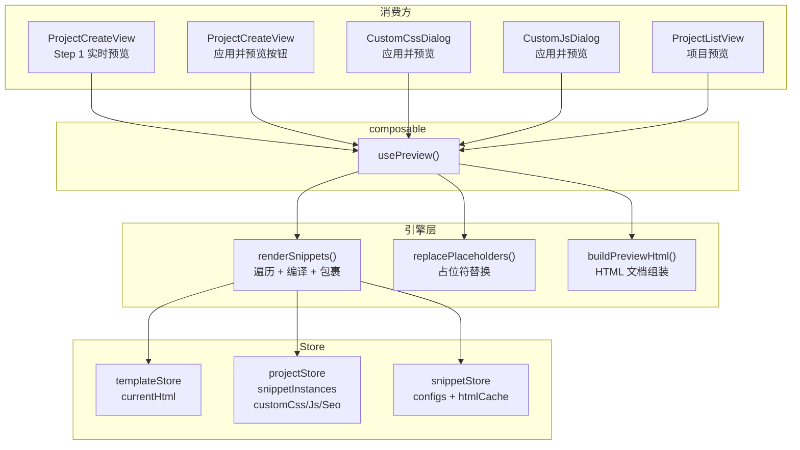

## 产品概述

重构模板生成器项目的预览渲染逻辑，实现统一、可靠、全场景覆盖的预览能力。

## 核心需求

1. **Step 1 模板实时预览增强**：切换选择模板时动态渲染预览，且若项目已有新增片段，需将启用的所有片段注入模板综合展示（用户数据 > 示例数据 > 留空）
2. **统一预览渲染管道**：将 4 处重复的片段渲染逻辑（ProjectCreateView、CustomCssDialog、CustomJsDialog、ProjectListView）抽取为单一 composable，消除代码重复，统一 compileTemplate 对 object/array/objectWithList 三种 formSchema.type 的处理
3. **全场景预览一致性**：创建过程、定制 CSS、定制 JS、列表页等所有预览入口均正确渲染完整内容（模板 + 片段 + CSS + JS + SEO）
4. **保持独立片段预览不变**：SnippetAddDialog 中的 hover 预览使用 buildSnippetPreviewHtml，不纳入统一管道

## 技术栈

- Vue 3 Composition API + TypeScript
- Pinia 状态管理
- lodash-es template 编译
- Vite 构建

## 实现方案

### 核心策略：提取 `usePreview` composable

将分散在 4 个组件中完全重复的片段渲染逻辑提取为 `src/composables/use-preview.ts`，作为所有页面级预览的唯一入口。该 composable 封装了从"读取数据 -> 解析片段 -> 编译模板 -> 替换占位符 -> 组装 HTML"的完整管道，并确保对 object/array/objectWithList 三种 formSchema.type 统一处理。

### Step 1 预览增强

将现有的 `templatePreviewHtml`（只渲染纯模板）改为调用 `usePreview` 的统一管道，使其在 Step 1 即可展示模板 + 已添加的片段综合效果。由于 Step 1 时 snippetInstances 来自 projectStore.currentProject（此时可能为 null），需要在 composable 中兼容空实例列表的场景。

### 统一 compileTemplate 的数据传递逻辑

当前各处的 compileTemplate 调用对 array 类型的处理不够完善，统一管道需标准化三种类型的处理：

- `object`：直接展开 `{ ...data }`
- `array`：包裹为 `{ features: data }`
- `objectWithList`：直接传递 `{ ...data }`（groups 内的数组字段已在 data 中）

### 对 ProjectListView 的特殊处理

列表页预览是异步操作（需要动态加载模板和片段 HTML），composable 提供一个 `generatePreviewHtml` 异步方法，接收必要的参数并返回完整 HTML 字符串。

### 保留 buildSnippetPreviewHtml

SnippetAddDialog 中的独立片段 hover 预览保持现有逻辑不变，它只渲染单个片段，不涉及完整页面。

### 关键设计决策

1. **composable vs store**：选择 composable 而非 store，因为预览是纯派生计算，不需要独立状态管理，且 composable 可在各组件中灵活注入不同参数（CSS/JS 覆盖等）
2. **同步 vs 异步**：对于已有缓存的场景（创建页、CSS/JS 对话框），使用同步 computed；对于需要异步加载的场景（列表页），提供异步方法
3. **fullPreviewHtml 不再需要**：现有的 fullPreviewHtml computed 与 templatePreviewHtml 合并为一个统一的 computed，由 `usePreview` 提供类似 `fullPreviewSrcdoc(overrides)` 的能力

## 实现说明

- 保持向后兼容：PreviewIframe、PreviewDialog 组件接口不变
- `buildPreviewHtml` 和 `buildSnippetPreviewHtml` 在 preview-renderer.ts 中保留
- template-engine.ts 中 `resolveSnippetData`、`wrapWithContainer`、`buildSpacingStyle`、`replacePlaceholders` 保持不变
- 不修改 store 层接口，composable 通过读取现有 store 数据工作
- CSS/JS 对话框的预览需要支持传入临时的 CSS/JS 覆盖值（编辑中但未保存的内容）

## 架构设计



## 目录结构

```
src/
├── composables/
│   ├── use-preview.ts          # [NEW] 统一预览 composable，核心渲染管道
│   └── ...
├── engines/
│   ├── template-engine.ts      # [MODIFY] compileTemplate 增加 objectWithList 支持
│   ├── preview-renderer.ts     # 保持不变
│   └── ...
├── views/
│   ├── ProjectCreateView.vue   # [MODIFY] 删除重复渲染逻辑，使用 usePreview
│   └── ProjectListView.vue     # [MODIFY] 删除重复渲染逻辑，使用 usePreview
├── components/
│   ├── css/CustomCssDialog.vue # [MODIFY] 删除重复渲染逻辑，使用 usePreview
│   └── js/CustomJsDialog.vue   # [MODIFY] 删除重复渲染逻辑，使用 usePreview
├── tests/
│   └── unit/
│       └── composables/
│           └── use-preview.test.ts  # [NEW] usePreview 单元测试
```

## 关键代码结构

`usePreview` composable 的核心接口：

```typescript
interface PreviewOverrides {
  css?: string        // 临时 CSS 覆盖（编辑中未保存）
  js?: string         // 临时 JS 覆盖
  seoTitle?: string
  seoDescription?: string
  seoKeywords?: string
  templateHtml?: string  // 可选：传入自定义模板 HTML
}

function usePreview() {
  // 同步 computed，基于当前 store 数据
  const fullPreviewSrcdoc: ComputedRef<string>
  
  // 支持 overrides 的 computed（用于 CSS/JS 对话框的编辑中预览）
  const previewSrcdoc: (overrides: PreviewOverrides) => ComputedRef<string>
  
  // 异步方法，用于列表页预览（需动态加载资源）
  const generatePreviewHtml: (project: Project) => Promise<string>
  
  return { fullPreviewSrcdoc, previewSrcdoc, generatePreviewHtml }
}
```

`renderSnippets` 纯函数（内部实现，导出用于测试）：

```typescript
interface RenderSnippetsInput {
  instances: SnippetInstance[]
  configs: Map<string, SnippetConfig>
  getHtml: (id: string) => string
}

function renderSnippets(input: RenderSnippetsInput): { placeholder: string; html: string }[]
```