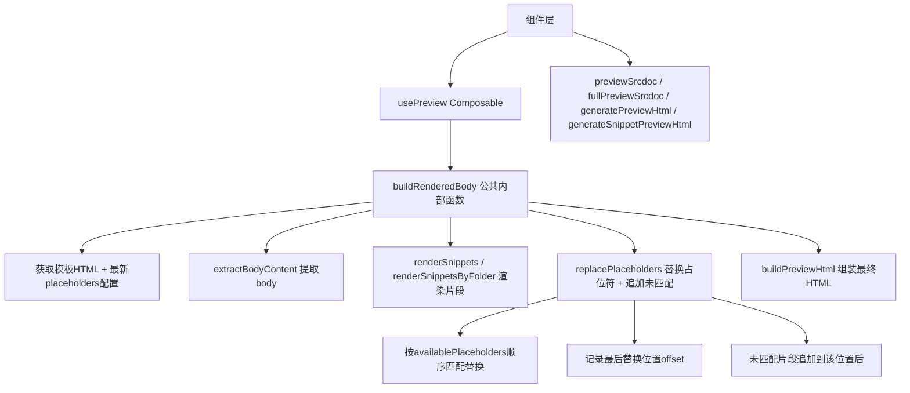

## 产品概述

重构模板渲染的核心流程，统一所有预览位置的渲染逻辑，解决当前代码中存在的 3 个核心问题：未匹配片段丢失、占位符列表未被使用、4处重复的预览代码。

## 核心功能

### 渲染主流程（用户定义的规则）

1. **模板 + SEO 注入**：选择指定模板，将 SEO 相关信息（title/keywords/description）传入模板
2. **CSS 注入位置**：定制的 CSS 放在 `<head>` 标签末尾（`</head>` 之前）
3. **JS 注入位置**：定制的 JS 放在 `<body>` 标签末尾（`</body>` 之前）
4. **片段渲染规则**：

- **优先匹配**：将片段渲染到模板中对应的占位标识符位置（格式 `<!-- placeholder:name -->`）
- **多对一支持**：同一个占位标识符可能有多个片段同时使用，都放在该位置
- **未匹配追加**：未能匹配到任何可用占位符的片段，按照片段列表原始顺序依次追加到最后一个被渲染的占位标识符后面

5. **动态占位符获取**：每次渲染前从 `TemplateConfig.placeholders` 获取最新可用的占位符列表
6. **残留空占位符**：保留不动，不清理
7. **公共逻辑提取**：所有需要预览的地方（编辑页、CSS对话框、JS对话框、列表卡片、片段添加框）共用同一套渲染逻辑

## 技术栈

- **框架**: Vue 3 + TypeScript (Composition API)
- **状态管理**: Pinia stores (project, template, snippet)
- **模板引擎**: lodash-es/template
- **构建工具**: Vite

## 实现方案

### 系统架构

采用分层架构：引擎层（纯函数）→ Composable 层（组合式逻辑）→ 组件层（UI 消费）。本次改造聚焦于引擎层和 Composable 层。



### 模块改造详情

#### 1. 重构 replacePlaceholders — `src/engines/template-engine.ts`

**新签名**:

```typescript
export function replacePlaceholders(
  templateHtml: string,
  renderedSnippets: RenderedSnippet[],
  availablePlaceholders: string[],   // 新增参数：从 TemplateConfig.placeholders.map(p => p.name) 获取
): string
```

**执行逻辑**:

- **Step 1 — 分离两组**: 遍历 renderedSnippets，提取每个 snippet 的 placeholder name（去掉 `placeholder:` 前缀），判断是否在 availablePlaceholders 中 → 分为 matched 组和 unmatched 组，保持各自原始顺序
- **Step 2 — 匹配组替换**: 按 availablePlaceholders 数组顺序遍历（即模板配置中定义的占位符顺序），对每个占位符名在 templateHtml 中查找所有 `<!-- placeholder:name -->` 出现位置；将该名对应的 matched snippets 逐一替换这些出现位置（同一占位符多个片段按顺序放入）；精确追踪每次替换后的字符串偏移量，记录最后一个被成功替换内容的结束位置（lastInsertEndPos）
- **Step 3 — 未匹配组追加**: 如果存在 lastInsertEndPos，将 unmatched 组的所有 snippet html 按顺序拼接到该位置之后；如果没有任何占位符被匹配到，则追加到 templateHtml 末尾
- **Step 4 — 残留处理**: 空占位符注释保留不动（用户明确要求），不做清理

#### 2. 提取 buildRenderedBody 公共函数 — `src/composables/use-preview.ts`

新增内部异步函数，作为 4 个预览方法的唯一核心：

```typescript
/**
 * 公共渲染核心：统一处理模板加载 → 占位符获取 → body提取 → 片段渲染 → 占位符替换
 */
async function buildRenderedBody(options: {
  templateHtml?: string           // 已有模板 HTML（同步路径，如 store 中已缓存）
  templateId?: string             // 模板 ID（异步加载路径）
  instances?: SnippetInstance[]   // 片段实例列表（项目编辑场景）
  folders?: string[]              // 片段文件夹列表（片段添加场景）
  useSampleData?: boolean         // 是否使用 sampleData（默认 false）
}): Promise<string>
```

**内部流程**:

1. 确定 templateHtml：优先使用传入值，否则按 templateId 异步调用 getTemplateHtml 加载
2. 获取最新 placeholders：

- 同步路径：从 templateStore.currentConfig?.placeholders 提取 name 列表
- 异步路径：调用 getTemplateConfig(templateId) 加载配置后提取

3. extractBodyContent(templateHtml) 提取 body 内容
4. 根据 instances 或 folders 选择调用 renderSnippets() / renderSnippetsByFolder()
5. 调用新版 replacePlaceholders(body, snippets, placeholders)
6. 返回最终 body content 字符串

#### 3. 简化 4 个预览入口 — `src/composables/use-preview.ts`

| 方法 | 改造方式 | 数据来源 |
| --- | --- | --- |
| `fullPreviewSrcdoc` (computed) | getter 内同步读取 currentHtml + currentConfig.placeholders，调用 renderSnippets + 新 replacePlaceholders + buildPreviewHtml | store 已有数据 |
| `previewSrcdoc(overrides)` (返回 ComputedRef) | computed getter 内同上逻辑 + overrides 合并 CSS/JS/SEO | overrides 参数 |
| `generatePreviewHtml` (async) | 调用 buildRenderedBody({ templateId, instances }) + buildPreviewHtml | 项目数据参数 |
| `generateSnippetPreviewHtml` (async) | 调用 buildRenderedBody({ templateId: templateFolder, folders: snippetFolders, useSampleData: true }) + buildPreviewHtml | 片段夹参数 |


**关键设计决策 — computed 中避免 async**: fullPreviewSrcdoc 和 previewSrcdoc 是 computed 响应式属性，不能直接 await。解决方案是它们依赖的 templateStore.currentHtml 和 templateStore.currentConfig 在 selectTemplate 时已预先加载完成，因此这两个方法内部走同步路径即可。

## 关键实现细节

### 性能考量

- replacePlaceholders 使用单次遍历 + 偏移量追踪，时间复杂度 O(n+m)，n 为片段数，m 为模板中占位符数
- 字符串拼接使用 slice 方式避免中间字符串创建过多的问题
- buildRenderedBody 的异步路径仅在首次调用或模板切换时触发网络加载，后续由 YAML 缓存覆盖

### 兼容性保障

- CustomCssDialog.vue 的 `previewSrcdoc({ css, templateHtml, seoTitle })` 调用签名完全不变
- CustomJsDialog.vue 的 `previewSrcdoc({ css, js, templateHtml, seoTitle })` 调用签名完全不变
- ProjectListView.vue 的 `generatePreviewHtml(project)` 调用签名完全不变
- SnippetAddDialog.vue 的 `generateSnippetPreviewHtml(options)` 调用签名完全不变
- 导出的纯函数 compileSnippetByType / renderSnippets / renderSnippetsByFolder 保持原有签名不变，供外部测试使用

### 错误处理

- replacePlaceholders 对空 availablePlaceholders 降级为将全部片段追加到模板末尾
- buildRenderedBody 在模板加载失败时返回空字符串，由调用方决定是否展示错误状态
- 保持现有的 compileSnippetByType 降级逻辑（编译失败用 raw HTML）

## 目录结构

```
src/
├── engines/
│   └── template-engine.ts        # [MODIFY] 重写 replacePlaceholders，增加 availablePlaceholders 参数和未匹配追加逻辑
├── composables/
│   └── use-preview.ts            # [MODIFY] 提取 buildRenderedBody 内部公共函数，简化 4 个预览入口实现
├── components/
│   ├── css/CustomCssDialog.vue   # [无改动] 接口兼容
│   ├── js/CustomJsDialog.vue     # [无改动] 接口兼容
│   └── snippet/SnippetAddDialog.vue  # [无改动] 接口兼容
└── views/
    ├── ProjectCreateView.vue     # [无改动] 接口兼容
    └── ProjectListView.vue       # [无改动] 接口兼容
```

本任务不涉及 UI 创建或大幅改造，仅为底层渲染逻辑的重构。UI 层接口保持完全兼容，无需修改设计。